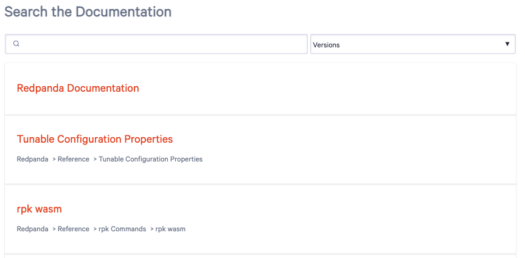

= Search Component
:url-docs: https://docs.redpanda.com
:url-org: https://github.com/redpanda-data
:url-docs: {url-org}/documentation
:url-ui: {url-org}/docs-ui
:url-extensions: {url-org}/docs-extensions-and-macros
:hide-uri-scheme:
:url-contributing: {url-org}/docs-site/blob/main/meta-docs/CONTRIBUTING.adoc
:url-netlify: https://netlify.com
:url-netlify-docs: https://docs.netlify.com
:url-antora-docs: https://docs.antora.org
:url-redoc: https://github.com/Redocly/redoc
:idprefix:
:idseparator: -
ifdef::env-github[]
:important-caption: :exclamation:
:note-caption: :paperclip:
endif::[]

This branch contains the site-wide search page for the Redpanda docs.

Search is powered by an link:{url-algolia}[Algolia] search index. The index is generated on each build of the production site using the {url-extensions}[Algolia indexer extension].

== Contributing

To learn how to use the playbook and generate the docs site locally, see our link:{url-contributing}[contributing guide].