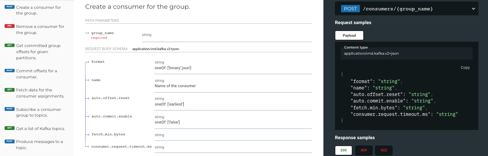

= API Component
:url-docs: https://docs.redpanda.com
:url-org: https://github.com/redpanda-data
:url-ui: {url-org}/docs-ui
:url-extensions: {url-org}/docs-extensions-and-macros
:hide-uri-scheme:
:url-contributing: {url-org}/docs-site/blob/main/meta-docs/CONTRIBUTING.adoc
:url-netlify: https://netlify.com
:url-netlify-docs: https://docs.netlify.com
:url-antora-docs: https://docs.antora.org
:url-redoc: https://github.com/Redocly/redoc
:idprefix:
:idseparator: -
ifdef::env-github[]
:important-caption: :exclamation:
:note-caption: :paperclip:
endif::[]
:toc:
:toc-title: Contents

This branch contains OpenAPI spec files to be hosted in the Redpanda documentation.

The OpenAPI spec files are stored in the `modules/ROOT/attachments/` directory.

The Asciidoc pages reference these attachments in the `page-api-spec-url` attribute. The {url-ui}/blob/main/src/layouts/swagger.hbs[`swagger` UI layout] uses this attribute to render the OpenAPI docs using {url-redoc}[Redoc].

== Contributing

To learn how to use the playbook and generate the docs site locally, see our link:{url-contributing}[contributing guide].